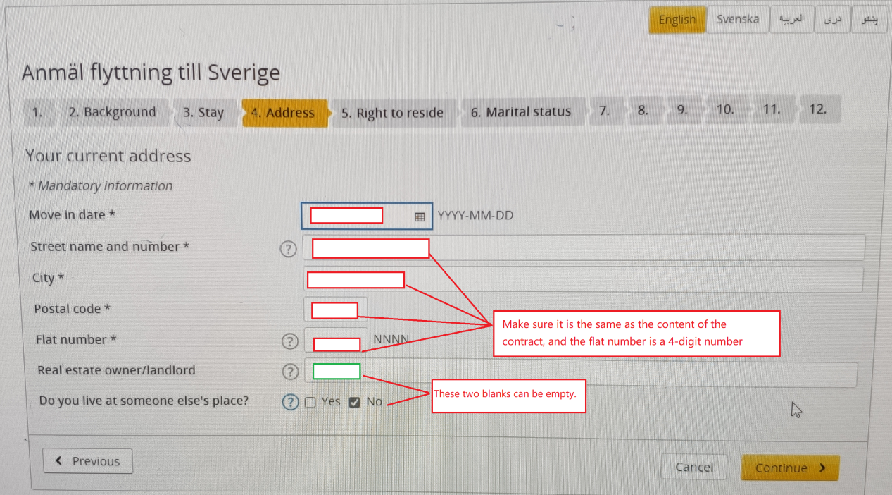
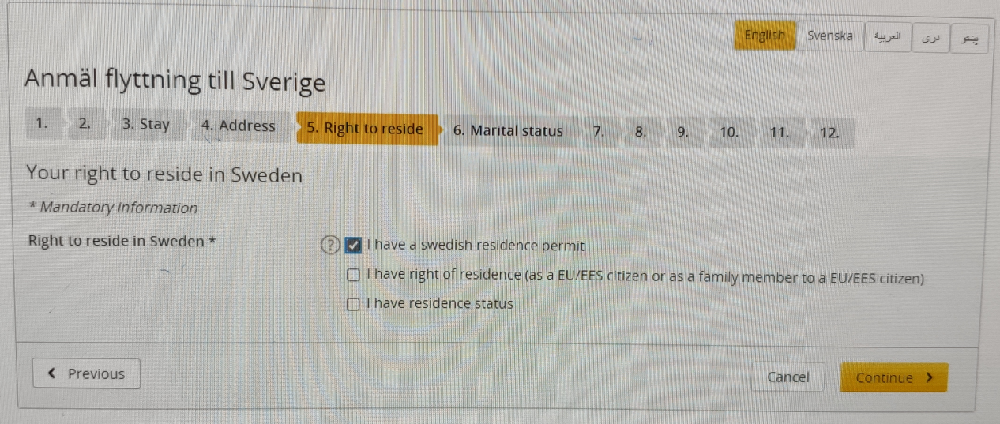
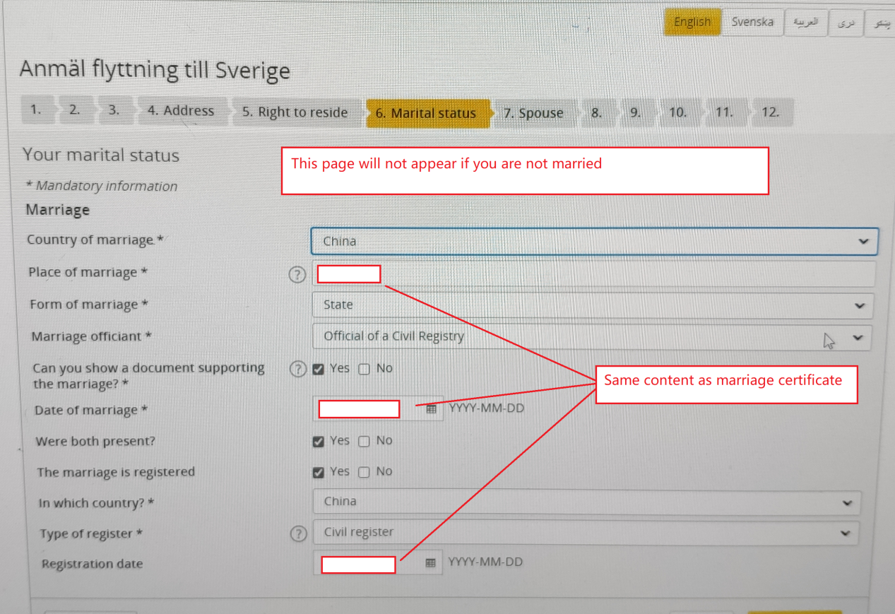
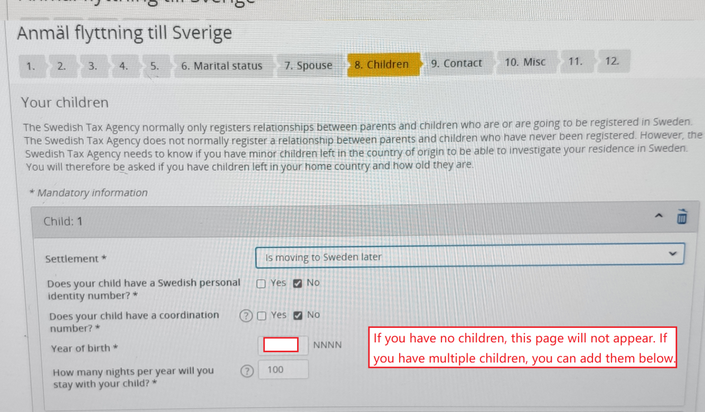
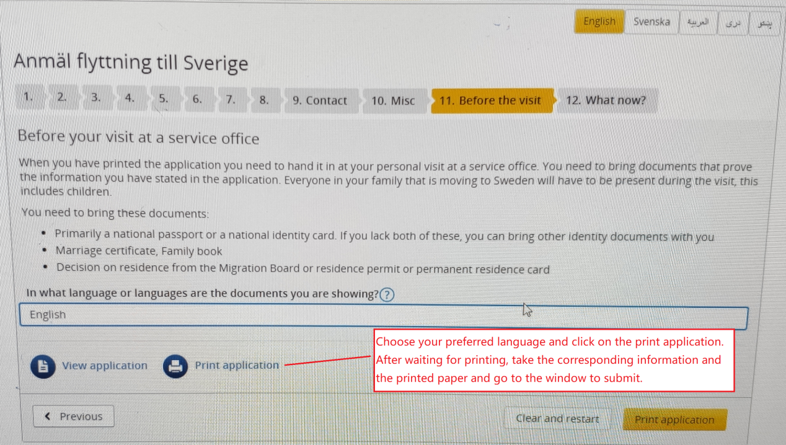

# How to apply personal number
## Step 1:
##### At first check your map, search a nearest “tax agency”, “tax office” or ”Skattekontoret” (Swedish).

## Step 2：
##### Bring your Passport, Work permit card; Marriage certificate & legalized translation if not single, Kid's birth certificate & legalized translation if have kids to Skattekontoret. Take a ticket and wait.

## Step 3:
##### The officer will check your files and you can fill the website on the computer they will find for you. Fill it step by step.

##### Usually the waiting time is 1 to 3 months, check your mailbox regularly, Tax Agency will send you a letter by post with your personal number. When you recieve the letter, send your personal number to admin@orientalent.se to update your infomation in the company.

##### Log in to the website to make an appointment to take pictures on site. 

Link: https://ssc.nemoq.se/booking/booking/index/ssc

Notice: You can book a photoshoot time before you receive the letter. If you haven't received it 2 days before the appointment, you can use the dialog box on the right to change the appointment time. This will save some time.

##### Before taking the photo, you need to pay the card production fee according to the payment method specified in the letter. Approximate 400 kroner.

##### Then go to "Skattekontoret" again to take a picture. After about 2 months, you can get an ID card. Then apply for a bank card with your ID card. Send your bank account number to admin@orientalent.se by E-mail.
