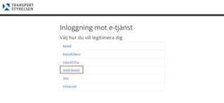
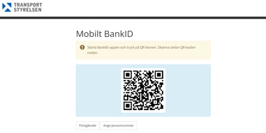
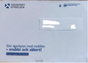
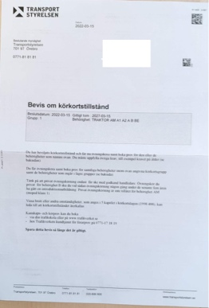
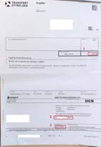
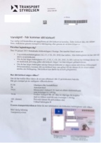

# Driving license guide

After you get BankID, you can go to this link [https://kat3-transportstyrelsen.hss.nexusgroup.com](https://kat3-transportstyrelsen.hss.nexusgroup.com)

Click Mobile BankID, then use your BankID app to scan below QR code.

Normally will be failed, you have to call 0771818181(open hours: working day 8AM-4:30PM), usually you have to wait in queue at 15-20min(I suggest call this number at noon), tell them you can not register by BankID, you want to get the driving license. Then they will fix that after 1 hour. 1 hour later you can scanned by bankID again. You will find a question form, such as: 

* Do you have a mental illness?
* Have you taken drugs?

You can select “No”. Then submit that.

Go to driving school or optical shop to test your eyes. They will submit your test result to transport styrelsen (supply your ID number, make sure your address is correct.). One to two weeks later you will received a letter.

Bring this letter go to driving school, they will arrange an appointment to test your driving skill. After that your coach will give your recommendation to buy which package. Then they will help you to book risk 1, risk 2, theory test, driving test. Or you can book and pay for theory test and driving test at [https://fp.trafikverket.se/boka/#/](https://fp.trafikverket.se/boka/#/) by yourself.

You can find average price of a driving license and some tips at [https://korkortonline.se/en/facts/](https://korkortonline.se/en/facts/). 

Risks 1 and 2 will pass as long as you go to participate. After that, you will mainly learn theory and driving skills.

When it comes to the theory test, arrive early, you need to take a photo and sign signature on a machine (This is the photo and signature on your driver's license). The photo fee is 80kr, which can be paid on the website where the exam is scheduled.

When you pass both tests, you can use your ID card to legally drive a vehicle after passing the test and before you get your driver's license.
You will receive two letters in about 1-2 weeks, one for payment and one for your driver's license. 

Cost: 280 (1), Payment Account: 50516913 (3), OCR: ********************(2).

Congratulations, you have obtained your Swedish driver's license.
